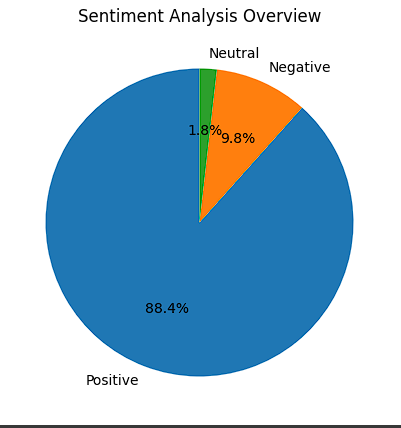
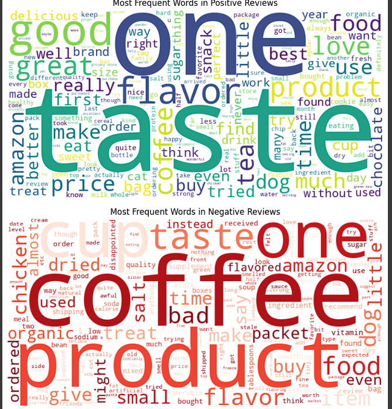

  

# amazon-reviews-sentiment-analysis

## Run on Google Colab
[Open in Google Colab](https://colab.research.google.com/drive/1bFi8JwvLYnmL_MWP5kwnvRV5F7mvRdlu#scrollTo=pJqFYnamnuJO)

## Overview
This project performs *Sentiment Analysis* on the Amazon Food Reviews dataset using Python.  
It involves:
- Text preprocessing and cleaning using NLTK  
- Sentiment classification using TextBlob  
- Data visualization with Matplotlib and Seaborn  
- WordClouds for most frequent words in positive and negative reviews  

## Project Steps
1. *Load Data* – Import Amazon reviews dataset.  
2. *Text Cleaning* – Remove HTML tags, punctuation, and stopwords.  
3. *Sentiment Analysis* – Use TextBlob to classify each review.  
4. *Visualization* – Create a bar chart for sentiment distribution and a WordCloud for most frequent words.

## Visualization
## 📊 Visualizations

*1️ Sentiment Distribution (Bar Chart)*  
Shows the number of Positive vs Negative reviews.

---

*2️ Sentiment Ratio (Pie Chart)*  
Represents the percentage of each sentiment category.

---

*3️ WordCloud - Most Frequent Words*  
Highlights the most common words used in the reviews.

## Tech Stack
- Python  
- Pandas  
- NLTK  
- TextBlob  
- Matplotlib  
- WordCloud

## Insights
- Most reviews were *positive*, indicating good product satisfaction.
- TextBlob provides a quick and interpretable sentiment polarity for each review.

##  Author
*Mariam Atef*  
[mariaaam22m@gmail.com]  
[https://www.linkedin.com/in/mariam-atef22]

